# 基本飲料點餐系統
## 系統流程圖:
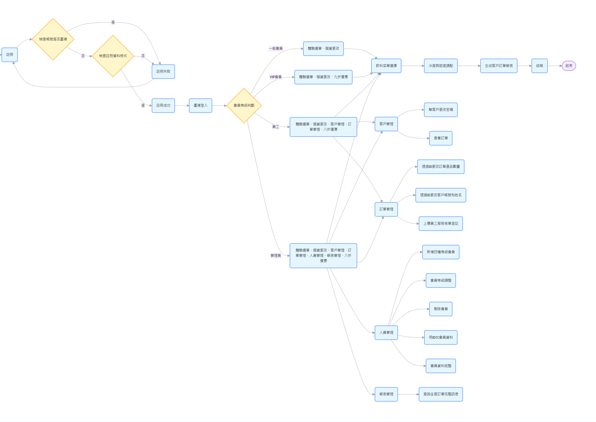
- 流程圖說明
1. 註冊流程：從註冊開始，先檢查帳號是否重複，再檢查註冊資料格式。若有一項不通過則註冊失敗，需重新註冊；若都通過則註冊成功，進入重複登入流程。
2. 登入流程：根據不同的會員等級，用戶會進入不同的功能界面。一般會員和 VIP 會員有體驗選單和個資更改功能；員工除了上述功能外，還有客戶管理和訂單管理功能；管理員則擁有最全的功能，包括人員管理和報表管理。
3. 飲料訂購流程：所有會員都可以進入飲料菜單選擇，選擇後進行冰度與甜度調配，生成客戶訂單報表，最後結帳。
4. 不同權限功能流程：員工和管理員可以進行客戶管理、訂單管理；管理員還額外擁有人員管理和報表管理功能，每個功能又細分了具體的操作項。
這個流程圖展示了系統從註冊到不同會員等級的操作流程，清晰地呈現了各個環節之間的關系和功能差異。

## 畫面展示

### 1.註冊畫面:
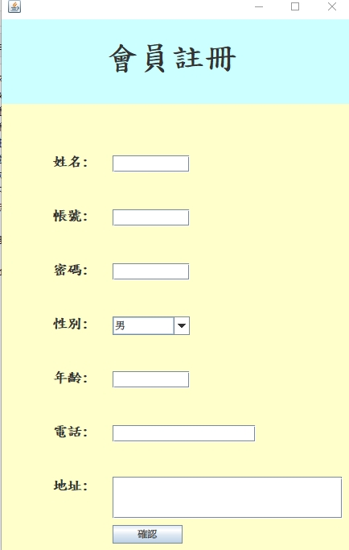
### 2.登入畫面:
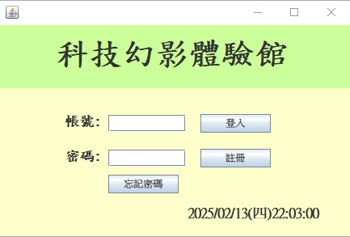
### 3.會員登入後畫面:
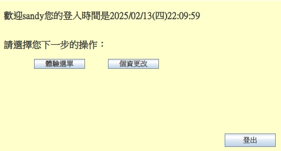
### 4.員工登入後畫面:
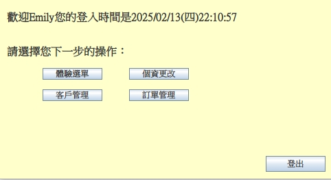
### 5.管理員登入畫面:
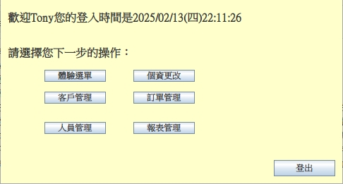
### 6.管理員進入飲料點餐畫面:訂單自動打八折
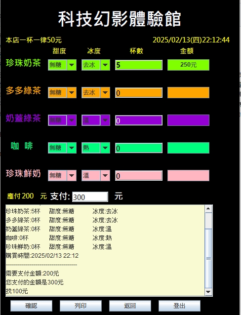
### 7.個資更改系統:
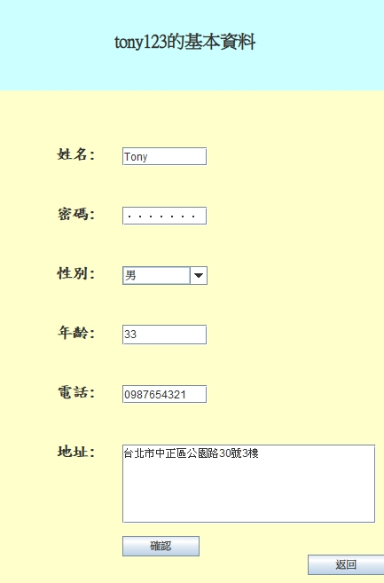
### 8.客戶管理系統:
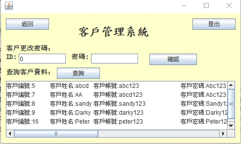
### 9.訂單管理系統:
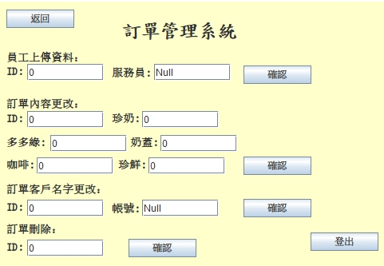
### 10.會員管理系統:
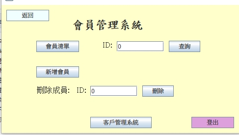
### 11.會員管理系統-會員清單:
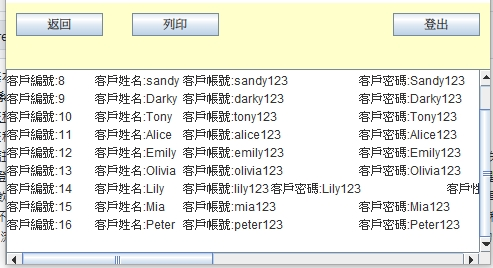
### 12.會員管理系統-新增會員(會員新增更改系統):
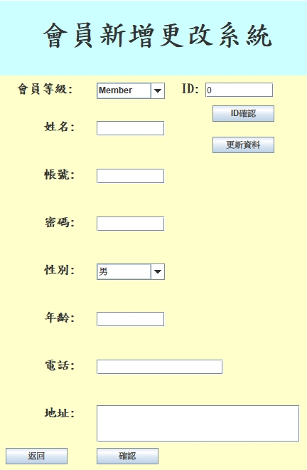
### 13.最終報表總覽:
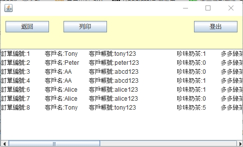

## 此系統總結:
#### 該系統是一個綜合的會員管理與飲品訂購系統，圍繞會員註冊、登錄、功能使用和訂單處理展開，涵蓋會員管理、飲品訂購、訂單處理、人員管理和報表管理等多個功能模塊，根據會員等級提供差異化服務。
#### 1.會員註冊：用戶進行註冊時，系統會檢查賬號是否重覆以及註冊資料是否符合格式要求。註冊成功後，用戶可重覆登錄系統。系統僅允許註冊普通會員。
#### 2.會員等級與功能權限：
##### 一般會員：擁有體驗菜單（飲品菜單）和個人資料更改功能。
##### VIP 會員：除一般會員功能外，在飲品結賬時享受九折優惠。
##### 員工：具備體驗菜單、個人資料更改功能，還能進行客戶管理（如更改客戶密碼、查看訂單）和訂單管理（如通過 ID 更改訂單產品數量、客戶賬號及姓名，上傳員工服務表單登記），飲品結賬享八折優惠。
##### 管理員：擁有員工的所有功能，還具備人員管理（如新增不同等級會員、調整會員等級、剔除會員、查詢會員資料、整合會員資料）和報表管理（查詢全面訂單完整信息）功能，飲品結賬同樣享八折優惠。
#### 3.飲品訂購：用戶在飲品菜單中選擇珍珠奶茶、多多綠茶、奶蓋綠茶、咖啡、珍珠鮮奶等飲品，並可根據個人喜好調配冰度和甜度。系統會生成客戶訂單報表，結帳時根據會員等級給予相應折扣。
#### 4.期望將來有機會把這個飲料系統更新到更完美，可以幫助到廣大的飲料店管理員
